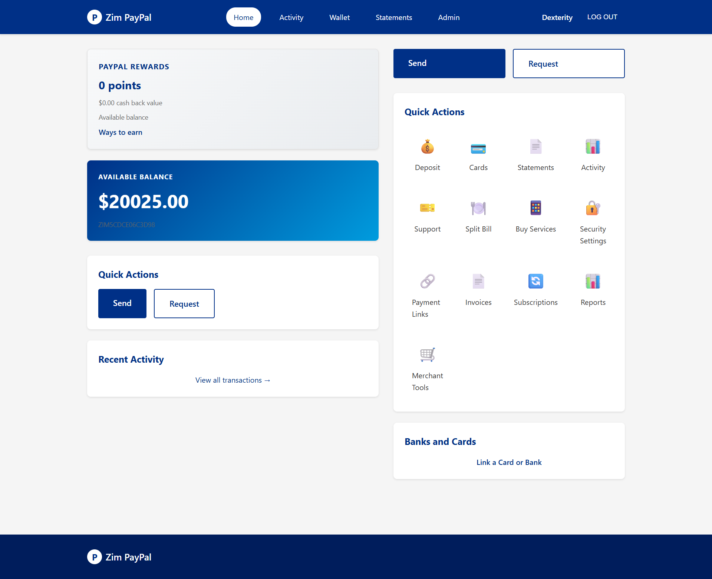
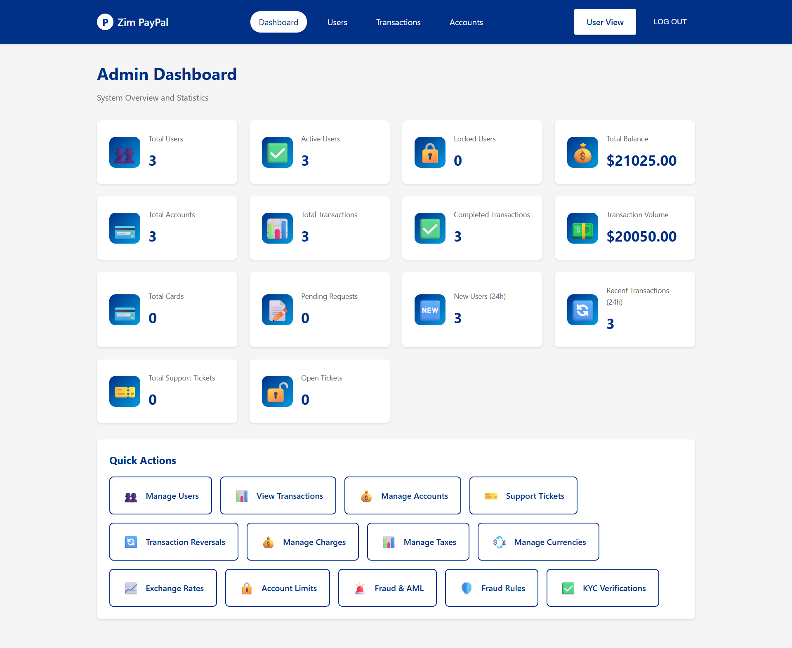

# Zim PayPal - Comprehensive Payment Platform

A full-featured PayPal clone built with Spring Boot, featuring secure payment processing, multi-currency support, fraud detection, payment gateway integration, and comprehensive financial management tools.

## 📸 Screenshots

### User Dashboard


### Admin Dashboard


## 🚀 Current Status

### ✅ Completed Features

#### Core Payment Features
- ✅ **User Registration & Authentication** - Secure user accounts with role-based access (USER, ADMIN, MERCHANT)
- ✅ **Account Management** - Multiple accounts per user with multi-currency support
- ✅ **Money Transfers** - Send money to other users via email
- ✅ **Deposits & Withdrawals** - Fund accounts and withdraw funds
- ✅ **Payment Gateway Integration** - EcoCash, PayNow Zim, PayPal integration with admin-configurable credentials
- ✅ **Card Management** - Link and manage payment cards
- ✅ **Transaction History** - Complete transaction tracking and statements
- ✅ **Payment Links** - Create shareable payment links for easy payments (public payment pages)
- ✅ **QR Code Payments** - Generate and download QR codes for payment links, scan-to-pay functionality
- ✅ **Invoicing System** - Create, send, and track invoices with line items, tax, and discounts
- ✅ **Recurring Payments & Subscriptions** - Auto-pay subscriptions with multiple billing cycles
- ✅ **Mobile App API** - RESTful API with JWT authentication for mobile applications
- ✅ **Webhooks** - Event webhooks with signature verification, retry mechanism, and delivery tracking
- ✅ **Advanced Reporting** - Financial reports, analytics, and exports (PDF, CSV, Excel, JSON)
- ✅ **Merchant Tools** - Payment buttons, embeddable widgets, checkout integration, API key management

#### Security & Compliance
- ✅ **Two-Factor Authentication (2FA)** - SMS, Email, and TOTP/App-based 2FA with backup codes
- ✅ **Anti-Money Laundering (AML)** - Automated AML compliance checks and reporting
- ✅ **Fraud Detection** - Real-time fraud detection with configurable rules
- ✅ **Risk Scoring** - Transaction and user risk assessment
- ✅ **Suspicious Activity Monitoring** - Automatic flagging and review workflow
- ✅ **KYC Verification** - Know Your Customer compliance with document verification
- ✅ **Transaction Limits** - Daily, weekly, and monthly transaction limits per user role

#### Financial Management
- ✅ **Multi-Currency Support** - Support for multiple currencies with exchange rates
- ✅ **Exchange Rate Management** - Admin-configurable exchange rates with effective dates
- ✅ **Charges & Fees** - Configurable transaction charges (fixed, percentage, tiered)
- ✅ **Tax Management** - Tax rate configuration with regulation tracking
- ✅ **Account Limits** - Configurable limits on accounts per user and transaction amounts
- ✅ **Transaction Reversals** - User-initiated reversals with admin approval workflow

#### Business Features
- ✅ **Money Requests** - Request money from other users with approval/decline workflow
- ✅ **Bill Splitting** - Split bills equally, by percentage, or custom amounts
- ✅ **Rewards & Points** - Earn and redeem rewards points with tier system
- ✅ **Service Purchases** - Buy airtime, data bundles, and ZESA tokens
- ✅ **Service Provider Integration** - Extensible provider system (Econet, NetOne, ZESA, etc.)

#### Support & Administration
- ✅ **Technical Support System** - Ticket-based support with messaging
- ✅ **Admin Dashboard** - Comprehensive admin panel with statistics
- ✅ **User Management** - Admin user management and role assignment
- ✅ **Transaction Oversight** - Admin view of all transactions
- ✅ **Fraud Management** - Admin tools for reviewing suspicious activities
- ✅ **KYC Management** - Admin approval workflow for KYC verifications
- ✅ **Payment Gateway Management** - Admin interface to configure gateway credentials (EcoCash, PayNow, PayPal)
- ✅ **Admin Fund Management** - Admin can add funds directly to user accounts
- ✅ **Feature Flags** - Admin can enable/disable features dynamically
- ✅ **Country Restrictions** - Admin can restrict features by country

#### Notifications
- ✅ **Email Notifications** - Transaction, request, and system notifications
- ✅ **SMS Notifications** - SMS alerts for important transactions (Twilio integration)

#### UI/UX
- ✅ **PayPal-Inspired Design** - Modern, clean interface
- ✅ **FontAwesome Icons** - Latest version (6.5.1) integrated
- ✅ **Sticky Header** - Navigation bar stays visible while scrolling
- ✅ **Responsive Design** - Mobile-friendly layouts

## 🛠️ Technology Stack

- **Backend**: Spring Boot 3.2.0
- **Database**: H2 (development) / PostgreSQL (production)
- **UI**: Thymeleaf templates with PayPal-inspired design
- **Security**: Spring Security with BCrypt password encoding, JWT for API
- **Migrations**: Flyway for database versioning
- **ORM**: Spring Data JPA / Hibernate
- **Email**: Spring Mail
- **SMS**: Twilio SDK
- **Payment Gateways**: Paynow Java SDK (PayNow Zimbabwe), PayPal (planned)
- **Build Tool**: Maven
- **Language**: Java 17 (Pure OOP principles)
- **Icons**: FontAwesome 6.5.1

## 📋 Roadmap & Priorities

### 🔴 High Priority (In Progress / Next)
1. ✅ **Payment Gateway Integration** - PayNow Zim SDK integrated (COMPLETED)
2. **PayPal SDK Integration** - Full PayPal payment processing
3. **EcoCash Direct Integration** - Direct EcoCash API integration
4. **Payment Gateway Webhooks** - Real-time payment status updates
5. **Payment Disputes** - Dispute management and resolution workflow
6. **Admin Gateway Management UI** - Complete admin interface for managing gateways

### 🟡 Medium Priority
7. **Bulk Payments** - Batch payment processing
8. **Payment Plans** - Installment payment plans
9. **International Transfers** - Cross-border payment routing
10. **Enhanced Account Statements** - PDF statement generation with branding
11. **Mobile App** - Native mobile applications (iOS/Android)
12. **API Rate Limiting** - API usage limits and throttling

### 🟢 Low Priority (Future Enhancements)
13. **Cryptocurrency Support** - Bitcoin, Ethereum integration
14. **Investment Features** - Savings accounts, investment products
15. **Advanced Loyalty Programs** - Enhanced loyalty and rewards
16. **Marketplace Integration** - E-commerce platform integration (WooCommerce, Shopify)
17. **Advanced Analytics** - Business intelligence and insights
18. **Multi-language Support** - Internationalization (i18n)

## 🗄️ Database Schema

The application uses Flyway for database migrations. Key tables include:

### Core Tables
- `users` - User accounts and authentication
- `accounts` - User wallet accounts (multi-currency)
- `transactions` - All financial transactions
- `cards` - Linked payment cards
- `statements` - Account statements

### Payment Features
- `payment_links` - Shareable payment links
- `invoices` - Invoice management
- `invoice_items` - Invoice line items
- `subscription_plans` - Subscription plan templates
- `recurring_payments` - Active subscriptions and recurring payments
- `payment_buttons` - Merchant payment buttons
- `merchant_api_keys` - Merchant API key management

### Payment Gateways
- `payment_gateways` - Payment gateway configurations (EcoCash, PayNow, PayPal)
- `gateway_transactions` - Gateway transaction tracking

### Financial Management
- `currencies` - Supported currencies
- `exchange_rates` - Currency exchange rates
- `charges` - Transaction charges/fees
- `taxes` - Tax rates
- `account_limits` - Transaction and account limits

### Security & Compliance
- `two_factor_auth` - 2FA settings
- `risk_scores` - Risk assessments
- `suspicious_activities` - Flagged activities
- `fraud_rules` - Fraud detection rules
- `kyc_verifications` - KYC compliance

### Business Features
- `money_requests` - Money request workflow
- `bill_splits` - Bill splitting
- `bill_split_participants` - Bill split participants
- `rewards` - Rewards and points
- `service_providers` - Service provider integration
- `service_purchases` - Service purchase tracking

### Support & Admin
- `support_tickets` - Support tickets
- `support_messages` - Support ticket messages
- `transaction_reversals` - Reversal requests
- `webhooks` - Webhook configurations
- `webhook_events` - Webhook event tracking
- `webhook_event_deliveries` - Webhook delivery attempts
- `reports` - Report generation history
- `feature_flags` - Feature toggle management
- `country_restrictions` - Country-based feature restrictions

## 🚀 Getting Started

### Prerequisites
- Java 17 or higher
- Maven 3.6+
- H2 Database (embedded, for development)
- PostgreSQL 12+ (for production)

### Installation

1. Clone the repository:
```bash
git clone https://github.com/DexterWura/zim-paypal.git
cd zim-paypal
```

2. Configure application properties:
```yaml
# src/main/resources/application.yml
spring:
  datasource:
    url: jdbc:h2:mem:zimdb;DB_CLOSE_DELAY=-1;DB_CLOSE_ON_EXIT=FALSE;MODE=PostgreSQL
    driver-class-name: org.h2.Driver
    username: sa
    password: 
  mail:
    host: smtp.gmail.com
    port: 587
    username: ${MAIL_USERNAME:}
    password: ${MAIL_PASSWORD:}
  twilio:
    account-sid: ${TWILIO_ACCOUNT_SID:}
    auth-token: ${TWILIO_AUTH_TOKEN:}
    phone-number: ${TWILIO_PHONE_NUMBER:}

app:
  base-url: http://localhost:80
  jwt:
    secret: ${JWT_SECRET:your-256-bit-secret-key-change-this-in-production}
    expiration: 86400000
```

3. Build and run:
```bash
mvn clean install
mvn spring-boot:run
```

4. Access the application:
- Landing Page: http://localhost:80
- Login: http://localhost:80/login
- Dashboard: http://localhost:80/dashboard (after login)
- H2 Console: http://localhost:80/h2-console (development only)

### Default Accounts

**Admin Account:**
- Username: `admin`
- Password: `admin123`
- Role: ADMIN

**Test User Account:**
- Username: `testuser`
- Password: `testuser123`
- Role: USER
- Initial Balance: $1000.00

**Note**: You can also register new accounts at `/register`. During registration, you can select "Admin" as the account type for testing purposes.

## 📝 API Documentation

The application provides RESTful APIs for:
- User authentication (`/api/auth/**`)
- User management (`/api/users/**`)
- Account operations (`/api/accounts/**`)
- Transaction processing (`/api/transactions/**`)
- Payment link creation (`/api/payment-links/**`)
- Invoice management (`/api/invoices/**`)
- Webhooks (`/api/webhooks/**`)
- Reports (`/api/reports/**`)

API endpoints require JWT authentication (except `/api/auth/**` and `/api/public/**`).

## 🔒 Security Features

- Password encryption with BCrypt (strength 10)
- Role-based access control (RBAC)
- JWT authentication for API
- Session-based authentication for web
- Two-factor authentication (2FA)
- Fraud detection and risk scoring
- AML compliance checks
- Transaction limits and monitoring
- Suspicious activity flagging
- CSRF protection for web forms

## 💳 Payment Gateway Integration

### Supported Gateways

1. **PayNow Zimbabwe** - Integrated via Paynow Java SDK
   - Web payments
   - Mobile money (EcoCash, OneMoney)
   - Admin configures Integration ID and Integration Key

2. **EcoCash** - Via Paynow SDK (mobile money)
   - Phone number required
   - Real-time payment processing

3. **PayPal** - Planned integration
   - Web payments
   - Credit card processing

### Admin Configuration

Admins can configure gateway credentials at `/admin/gateways`:
- Integration ID / Merchant ID
- API Key / Integration Key
- API Secret
- Webhook URLs
- Callback URLs

## 🌍 Multi-Currency Support

- Support for multiple currencies (USD, ZWL, EUR, GBP, ZAR, etc.)
- Admin-configurable exchange rates
- Real-time currency conversion
- Multiple accounts per currency per user
- Currency-specific transaction limits

## 📊 Admin Features

- User management and role assignment
- Transaction monitoring and oversight
- Fraud rule configuration
- Suspicious activity review
- KYC verification approval
- Currency and exchange rate management
- Charge and tax configuration
- Account limit management
- Support ticket management
- Transaction reversal processing
- Payment gateway management
- Direct fund addition to user accounts
- Feature flag management
- Country restriction management

## 🎯 Use Cases

- **Personal Payments**: Send/receive money, split bills, request payments
- **Business Payments**: Invoicing, payment links, merchant transactions
- **Service Purchases**: Airtime, data bundles, utility payments (ZESA, TelOne, etc.)
- **International Transfers**: Multi-currency support with exchange rates
- **Compliance**: KYC verification, AML checks, fraud prevention
- **Merchant Services**: Payment buttons, checkout integration, API access

## 📱 Mobile App API

The application provides a complete RESTful API for mobile applications:
- JWT-based authentication
- User account management
- Transaction processing
- Payment link creation
- Invoice management
- Real-time notifications

## 🔔 Webhooks

Webhook system for third-party integrations:
- Event subscriptions
- HMAC SHA256 signature verification
- Automatic retry with exponential backoff
- Delivery tracking
- Scheduled processing

## 📈 Reporting

Advanced reporting capabilities:
- Transaction Summary Reports
- Transaction Detail Reports
- Account Statements
- Revenue Reports
- Multiple export formats: PDF, CSV, Excel, JSON
- Scheduled report generation

## 🤝 Contributing

This is a learning project. Contributions and suggestions are welcome!

## 📄 License

This project is for educational purposes.

## 👨‍💻 Author

**dexterwura** - Zim Development Team

---

## 📌 Current Development Status

### ✅ Recently Completed
- Payment Gateway System (EcoCash, PayNow Zim, PayPal)
- Paynow Java SDK Integration
- Admin Gateway Management
- Admin Fund Management
- FontAwesome Icons Integration
- Sticky Header Navigation
- Statements Page Fixes
- Registration with Role Selection

### 🔄 In Progress
- PayPal SDK Integration
- Payment Gateway Webhook Processing
- Admin Gateway Management UI Templates

### 📋 Pending
- PayPal Full Integration
- EcoCash Direct API Integration
- Payment Disputes System
- Enhanced Mobile App API
- Bulk Payment Processing

---

**Note**: This is a comprehensive payment platform clone. For production use, ensure proper security hardening, compliance with financial regulations, and integration with real payment gateways.
